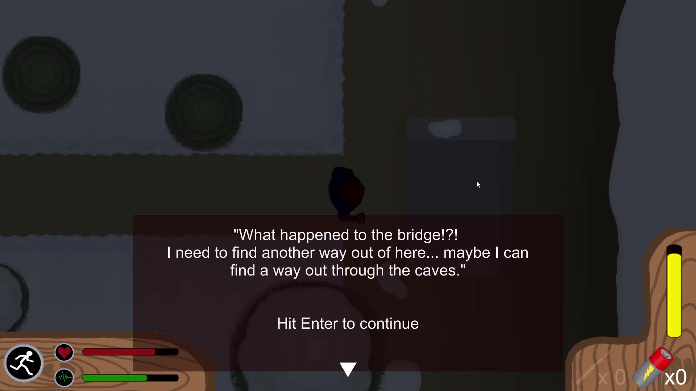
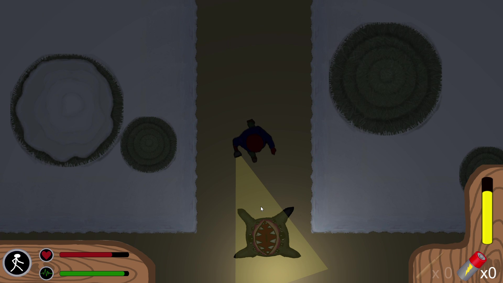
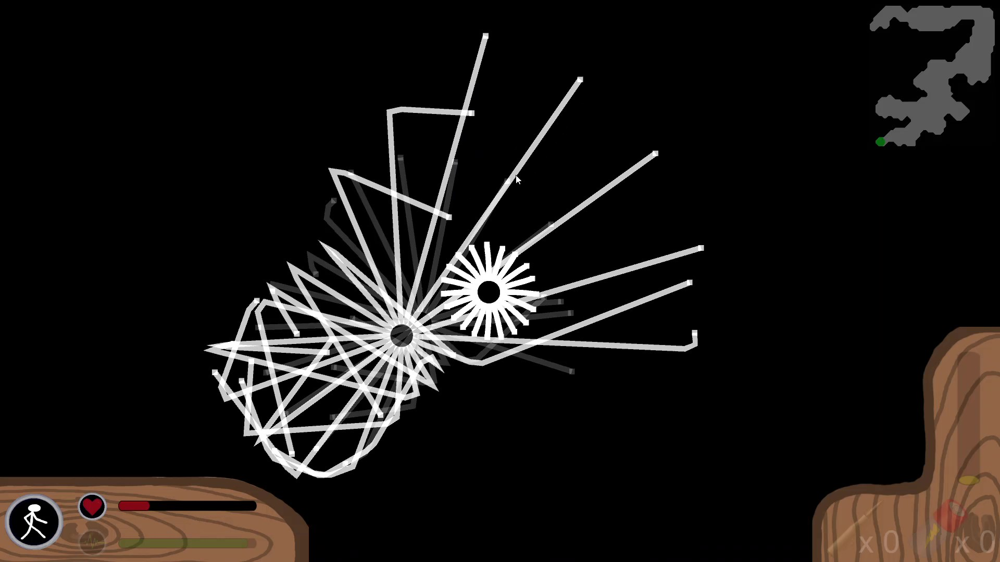
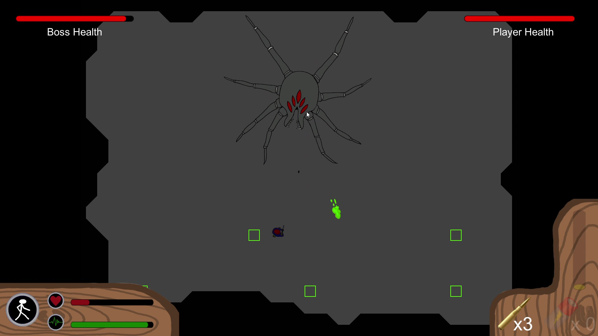

# Silent Night - 2020
#### A top down 2D horror experience in which the player attempts to escape a monster infested forest. Made for the class 2D Games at Grove City College

Avoid enemy AI using the games light and sound mechanics
Scare enemies away with light,

or try and stay quiet so the enemy can't find you.

Defeat the final boss and escape the forest!

Be careful not to let him blind you!
.jpg)

Links to gameplay footage:
* Level 1 Gameplay: https://youtu.be/sZoxhyOAAbg
* Level 2 Gameplay: https://youtu.be/CKJ2gBoYZo4
* Level 3 Gameplay: https://youtu.be/fErtqAiskfk
